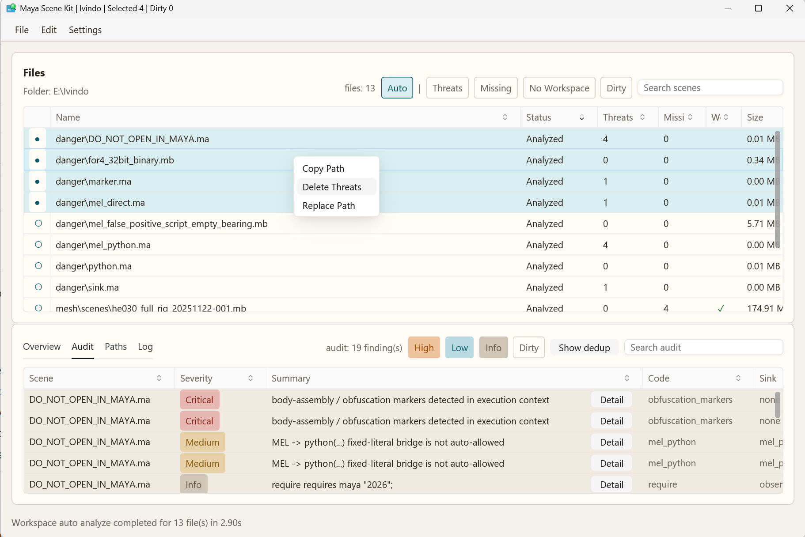

# maya-scene-kit

`maya-scene-kit` is an open-source toolkit for inspecting, auditing, converting,
and rewriting Maya scene files (`.mb` / `.ma`) without requiring a Maya runtime.

`maya-scene-kit` can be used to:

- inspect unknown Maya scenes before opening them in Maya
- audit script nodes and other execution-capable scene content
- scan folders from the GUI and review audit results and reference paths in one place
- extract file, reference, texture, and cache paths from `.ma` / `.mb` scenes
- stage clean, path replacement, path-owner deletion, or `.mb` to `.ma`
  conversion edits and save the resulting files
- integrate pre-open scene checks into Python tools or batch pipelines



It currently ships three practical entry points:

- GUI for interactive review and staged edits
- CLI for batch inspection and automation
- Python bindings for embedding scene checks into other tools

## Current Limitations

- `clean` and `replace` currently run only in `forensic` mode in both the CLI and the GUI
- They are intended for investigation and temporary remediation, and **do not guarantee a fully validated rewrite**
- `audit` is conservative: incomplete coverage, unknown semantics, parse
  budgets, or degraded validation can move a scene to review or deny depending
  on the audit profile

Related docs:

- [Japanese README](README.jp.md)
- [Python usage](docs/python_usage.md)
- [Advanced usage](docs/advanced_usage.md)
- [Development](docs/development.md)
- [Supplying and extrapolating studio-specific Maya node knowledge](docs/node_info_authoring.md)
- [Third-party notices](THIRD_PARTY_NOTICES.md)

## Quick Starts

The GUI and CLI are shipped in the same release archive. Download the archive
for your OS from GitHub Releases and extract it.

1. Open the Releases page
2. Download the `maya-scene-kit` archive for your platform
3. Extract it anywhere

### GUI

Example:

```powershell
maya-scene-kit-gui.exe
```

Use the GUI when you want to load files or folders, inspect audit findings, review
dump and path data, apply edits in stages, and save results without dropping into the CLI.

The GUI has Overview, Audit, Paths, and Log tabs. It can scan folders, filter
workspace rows, show audit details, stage clean, path-owner deletion, and path
replacement operations, convert scenes to Maya ASCII, create backups when
saving over existing files, and save selected or all dirty files.

#### Typical GUI workflow

The GUI is aimed at interactive scene triage and staged rewrite work:

1. Open a folder, enable `Auto`, and let it scan
2. Use the `Audit` tab to review results and stage clean actions when needed
3. Use the `Paths` tab to review reference paths and run replacements or related actions
4. Check dirty file rows in the workspace list, then save selected files or save all changes

### CLI

Example:

```powershell
maya-scene-kit.exe --help


Standalone utilities for Maya scene files (.mb/.ma).

Usage: maya-scene-kit <COMMAND>

Commands:
  inspect   Inspect Maya Binary chunk structure
  dump      Dump requires + script nodes from file or directory
  paths     Extract file/reference paths from file or directory
  audit     Audit execution surfaces with built-in policy and optional literal markers
  to-ascii  Convert Maya Binary (.mb) scenes to Maya ASCII (.ma)
  clean     Remove script nodes and save in forensic mode
  replace   Replace file/reference paths in scene files in forensic mode
  help      Print this message or the help of the given subcommand(s)

Options:
  -h, --help  Print help
```

#### Typical CLI workflow

For untrusted or unknown scenes, start with `audit` or `dump`.
Use `inspect` when you need to investigate `.mb` chunk structure further.
Avoid `replace` or `clean` when you cannot predict the rewrite outcome.
Use the GUI for interactive rewrite work.

Representative commands:

```bash
maya-scene-kit audit input.mb
maya-scene-kit dump input.mb --out /tmp/scene_dump.txt
maya-scene-kit paths input.mb --kind reference --json
maya-scene-kit inspect input.mb --max-depth 2
maya-scene-kit to-ascii input.mb output.ma --issues-json /tmp/issues.json
maya-scene-kit clean input.mb output_clean.mb
maya-scene-kit replace input.mb --rule "V:/dcc=X:/dcc" --out output.mb
```

### Python

Python bindings can be installed directly from a release wheel downloaded from GitHub Releases.
You can install them with `pip`, or unpack the zip and place them manually as a normal Python package.

```powershell
uv pip install --system .\maya_scene_kit-*.whl
```

Quick import check:

```powershell
python -c "import maya_scene_kit; print('maya_scene_kit ok')"
```

See [docs/python_usage.md](docs/python_usage.md) for practical Maya integration
examples and API details. For source builds and editable installs, see
[docs/development.md](docs/development.md).

#### Typical Python workflow

The Python bindings make it possible to inspect a scene before Maya itself opens
or imports the file.

This is an operational pattern built on the current API surface, not a dedicated
callback API:

```python
from maya_scene_kit import audit

report = audit("scene.mb", max_preview=120)

if report["blocked_on_uncertainty"]:
    raise RuntimeError("scene requires manual review before open")

if report["disposition"] not in {"allow", "allow_with_notice"}:
    raise RuntimeError(f"audit blocked scene: {report['disposition']}")

# Your tool decides what to do next.
# For example: open the file in a DCC, queue it for review, or copy it to a safe area.
```

Other Python entry points include `inspect_mb`, `collect_paths`, `dump_requires`,
`dump_scripts`, `preview_clean`, `clean`, `preview_replace`, `replace`, and
`to_ascii`.

---

For deeper reference material, including the CLI command summary, execution
modes, current scope, and runtime `--node-info` files, see
[docs/advanced_usage.md](docs/advanced_usage.md). For supplying and
extrapolating studio-specific Maya node knowledge, see
[docs/node_info_authoring.md](docs/node_info_authoring.md).
